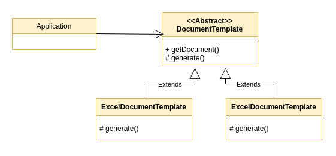

= Abstract Document Pattern
:source-highlighter: highlight.js
Anıl Şenocak <senocakanil@gmail.com>
2.0, April 16, 2024
:description: Tip güvenliği desteğini kaybetmeden projeye yeni özelliklerin eklenebildiği, güçlü bir şekilde yazılmış bir dildeki bileşenler arasında yüksek derecede `esneklik` elde etmek
:organization: Personal
:doctype: book
:preface-title: Preface
// Settings:
:experimental:
:reproducible:
:icons: font
:listing-caption: Listing
:sectnums:
:toc:
:toclevels: 3
:xrefstyle: short
:nofooter:
// URIs:

[%notitle]
--
[abstract]
{description}
--

== Açıklama
Statik olmayan ek özelliklerin ele alınmasını sağlar. Bu model, tip güvenliğini sağlamak ve farklı sınıfların özelliklerini arayüzler kümesine ayırmak için özellikler kavramını kullanır. Genel olarak bu ihtiyaçlar için kullanılıyor;

1. Anında yeni &ouml;zellikler eklenmek istendiğinde
2. Daha gevşek bağlı sistem(loosely coupled system) istendiğinde

----
Birden çok parçadan oluşan bir araba düşünün. Ancak, belirli bir arabanın gerçekten tüm parçalara mı yoksa sadece bir kısmına mı sahip olduğunu bilmiyoruz. Arabalarımız dinamik ve son derece esnektir.
----

Önce `Document` ve `AbstractDocument` temel sınıfları tanımlayalım. Temel olarak nesnenin bir özellik haritası ve herhangi bir miktarda alt nesne tutmasını sağlarlar.

[source,kotlin]
----
interface Document {
    fun put(key: String, value: Any)
    fun get(key: String): Any?
}
----

[source,kotlin]
----
abstract class AbstractDocument: Document {
    private val properties: MutableMap<String, Any?> = HashMap()

    override fun put(key: String, value: Any): Unit {
        properties[key] = value
    }
    override fun get(key: String): Any? = properties[key]
}
----

Daha sonra bir enum Property ile tip, fiyat, model ve parçalar için bir dizi arayüz tanımlarız. Bu, Car sınıfımıza statik görünümlü arayüz oluşturmamızı sağlar.

[source,kotlin]
----
enum class Property {
    TYPE, PRICE, MODEL
}

interface HasType : Document {
    val type: String?
        get() = get(key = Property.TYPE.toString()) as String?
}

interface HasPrice : Document {
    val price: Number?
        get() = get(key = Property.PRICE.toString()) as Number?
}

interface HasModel : Document {
    val model: String
        get() = get(key = Property.MODEL.toString()) as String
}
----

Şimdi Car'ı tanıtmaya hazırız.

[source,kotlin]
----
class Car: AbstractDocument(), HasModel, HasType, HasPrice
----
Car'ı tanımlayıp kullanma örneğimiz,

[source,kotlin]
----
fun main() {
    println("Constructing car")
    val car = Car()
        .also {
            it.put(key = Property.TYPE.toString(), value = "car")
            it.put(key = Property.MODEL.toString(), value = "300SL")
            it.put(key = Property.PRICE.toString(), value = 10000L)
        }
    println("Here is our car:")
    println("-> type: ${car.type}")
    println("-> model: ${car.model}")
    println("-> price: ${car.price}")
}
----

== Verification
[source,kotlin]
----
/*
Constructing car
Here is our car:
-> type: car
-> model: 300SL
-> price: 10000
 */
----

link:examples/abstract-document-pattern.kt[abstract-document-pattern.kt]

