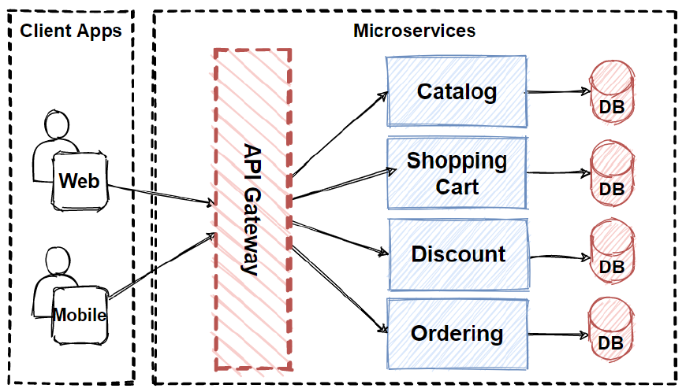

= Pattern: API Gateway
:source-highlighter: highlight.js
Anıl Şenocak <senocakanil@gmail.com>
2.0, April 16, 2024
:description: Kullanıcı, API Gateway'e tek bir istek yapar ve Gateway daha sonra ilgili her mikro servisi çağırır.
:organization: Personal
:doctype: book
:preface-title: Preface
// Settings:
:experimental:
:reproducible:
:icons: font
:listing-caption: Listing
:sectnums:
:toc:
:toclevels: 3
:xrefstyle: short
:nofooter:
// URIs:

[%notitle]
--
[abstract]
{description}
--

== Açıklama
Microservices pattern'i ile, bir müşteri birden çok farklı mikroservis verilerine ihtiyaç duyabilir. Eğer client her servisi doğrudan çağırırsa, çağrılan her servis için bir http isteği yapması gerekeceğinden, cevap'a ulaşmak uzun sürebilir. Ayrıca, müşterinin her mikro servisi çağırması (istemciyi doğrudan bu mikro servise bağlar) mikro serislerin dahili uygulamaları değişirse (örneğin, gelecekte iki mikro servis birleştirilirse) veya bir mikro servisin konumu değişirse, ardından bu mikro servisi kullanan her istemci güncellenmelidir.

TIP: Bu modelinin amacı, bu sorunlardan bazılarını hafifletmektir. Api Gateway deseninde, istemci ile mikro servisler arasına ek bir köprü vardır. Bu gateway'in işi, mikro servislere yapılan çağrıları toplamaktır. Her mikroservis'i ayrı ayrı çağıran client yerine, `Api Gateway` endpoint'i tek bir kez çağırılır.

[source,kotlin]
----
class ImageClient {
    val imagePath: String?
        get() {
            val httpGet = HttpRequest.newBuilder()
                .GET()
                .uri(URI.create("http://localhost:50005/image-path"))
                .build()
            try {
                val httpResponse = HttpClient.newHttpClient().send(httpGet, BodyHandlers.ofString())
                return httpResponse.body()
            } catch (e: IOException) {
                println("IOException: ${e.message}")
            } catch (e: InterruptedException) {
                println("InterruptedException: ${e.message}")
            }
            return null
        }
}
----
[source,kotlin]
----
class PriceClient {
    val price: String?
        get() {
            val httpGet = HttpRequest.newBuilder()
                .GET()
                .uri(URI.create("http://localhost:50006/price"))
                .build()
            try {
                val httpResponse = HttpClient.newHttpClient().send(httpGet, BodyHandlers.ofString())
                return httpResponse.body()
            } catch (e: IOException) {
                println("IOException: ${e.message}")
            } catch (e: InterruptedException) {
                println("InterruptedException: ${e.message}")
            }
            return null
        }
}
----
Burada API Gateway'in istekleri mikroservislere nasıl ilettiğini görebiliriz.
[source,kotlin]
----
class ApiGateway(
    private val imageClient: ImageClient,
    private val priceClient: PriceClient
){
    @GetMapping("/desktop")
    fun productDesktop(): Map<String, String?> =
        mapOf("image" to imageClient.imagePath, "price" to priceClient.price)

    @GetMapping("/mobile")
    fun productMobile(): String? = priceClient.price
}

----
