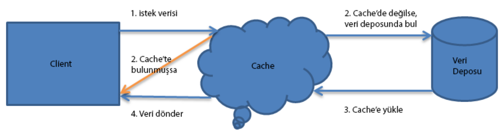

= Pattern: Cache Aside Pattern
:source-highlighter: highlight.js
Anıl Şenocak <senocakanil@gmail.com>
2.0, April 16, 2024
:description: Loads data into the cache on demand.
:organization: Personal
:doctype: book
:preface-title: Preface
// Settings:
:experimental:
:reproducible:
:icons: font
:listing-caption: Listing
:sectnums:
:toc:
:toclevels: 3
:xrefstyle: short
:nofooter:
// URIs:
:url-quickref: https://github.com/senocak/tutorials/tree/master/

[%notitle]
--
[abstract]
{description}
--

== Açıklama
Verileri önceden yüklemek mi yoksa kullanırken mi istediğinize bağlı olarak optimum cache'leme, okuma işlemleri ve veri alımını ayarlar.

Bu model, doğru kullanılırsa, verileri önbellekte cache'leyerek performansı iyileştirir.
Okuma işlemleri için, önce bir key kullanılarak verilerin kullanılabilirliği için önbellek kontrol edilir. Veri varsa, okuma çağrısı verileri cache'ten döndürür ve işlemi tamamlar. Verilerin cache'te bulunmadığı bir durumda, verileri almak için db'ye gidilir ve response döndürmeden önce bir key ile cache'e yazılır. Bu yeni oluşturulan cache, cache'ten alınan aynı veriler için sonraki okuma işlemlerini yapacak, böylece yanıt süresini kısaltacak ve verimi artıracaktır.

== Örnek
[source,kotlin]
----
@Cacheable(value = [AppConstants.CACHE_CATEGORY], key = "#idOrSlug", unless = "#result == null")
fun findCategory(idOrSlug: String): Category = categoryRepository.findByIdOrSlug(idOrSlug)
----

== Veri güncellemesi
DB'deki datalar güncelleniyorsa ve bu veriler önbellekte(cache) mevcutsa, cache'de güncellenmelidir. Senkronizasyon sorununu aşmak ve veri alımı için veri tutarlılığı ve performansını sağlamak için gereksinimlere bağlı olarak iki strateji kullanılabilir.

=== Veri Güncellemelerinde Cache Eviction
Bu durumda, veri deposundaki verileri güncellemek için bir metod çağrıldığında, anahtarı kullanarak önbellek girişini de geçersiz kılar. Bu yaklaşımda, önbellek girişi yalnızca güncellemeden sonra yeniden istendiğinde yüklenir. Spring, bunu aşağıdaki gibi yapılabilir:

[source,kotlin]
----
@Caching(
        evict = [CacheEvict(value = arrayOf(AppConstants.CACHE_CATEGORY), key = "#category.slug")],
        put = [
            CachePut(value = arrayOf(AppConstants.CACHE_CATEGORY), key = "#result.id"),
            CachePut(value = arrayOf(AppConstants.CACHE_CATEGORY), key = "#result.slug")
        ]
    )
fun updateCategory(category: Category, categoryUpdateRequestDto: CategoryUpdateRequestDto): Category {
    val categoryName: String? = categoryUpdateRequestDto.name
    if (categoryName != "")
        category.name = categoryName
    return saveCategory(category)
}
----

=== Veri Güncellemelerinde Cache Güncellemeleri
Cache dataları, tek seferde daha hızlı veri alma ve tutarlılık elde etmek için verileri veri deposunda güncellendiğinde de güncellenebilir. Spring, aşağıdakileri yaparak başarılabilir:

[source,kotlin]
----
@Caching(
    put = [
        CachePut(value = arrayOf(AppConstants.CACHE_CATEGORY), key = "#result.id"),
        CachePut(value = arrayOf(AppConstants.CACHE_CATEGORY), key = "#result.slug")
    ]
)
fun createCategory(categoryCreateRequestDto: CategoryCreateRequestDto): Category {
    var category: Category? = null
    try {
        category = findCategory(AppConstants.toSlug(categoryCreateRequestDto.name.toString()))
    } catch (serverException: ServerException) {
        log.debug("Caught ServerException, Post not exist in db")
    }
    if (category != null) {
        val error = "Category " + category.name + " already exist"
        log.error(error)
        throw ServerException(OmaErrorMessageType.BASIC_INVALID_INPUT, arrayOf(error), HttpStatus.CONFLICT)
    }
    category = Category()
    category.name = categoryCreateRequestDto.name.toString()
    return saveCategory(category)
}
----

=== Veri ihtiyacına ve türüne bağlı olarak, farklı önbellek yükleme stratejileri benimsenebilir.

==== Hareket halindeyken verileri yükleyin
İlk istek onu veri deposundan getirir, ancak sonraki istekler verileri önbellekten alır.

==== Önbelleği önceden yükle
Uygulamanın başlangıcında yüklenen veriler için kullanılır, ülke listesi, para birimi, önemli tarihler vb. gibi referans verileri için en iyisidir. Bu, çok sık değişmeyen veriler için idealdir.

link:https://github.com/senocak/Kotlin-Spring-Blog-Boilerplate/blob/b4c4c6840e84d3226b022cfd0a3f421cc9a50cd8/spring-kotlin/src/main/kotlin/com/github/senocak/service/CategoryService.kt[Kotlin-Spring-Blog-Boilerplate]
