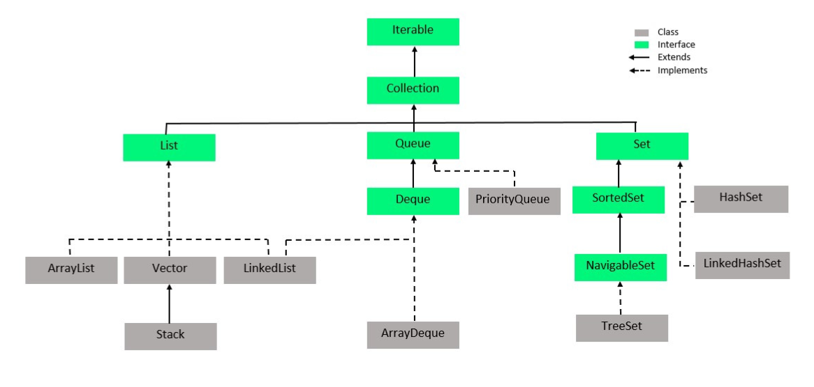
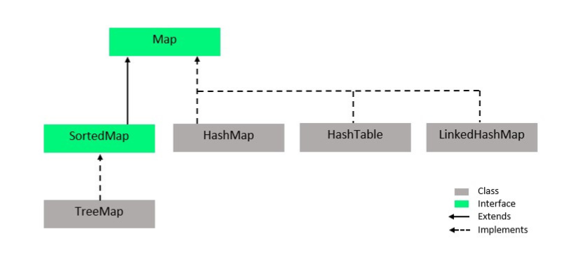
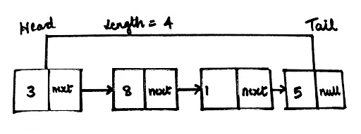
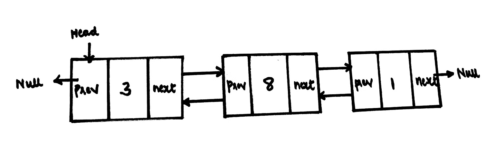
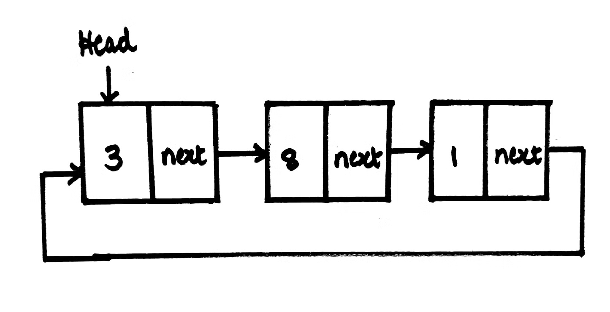
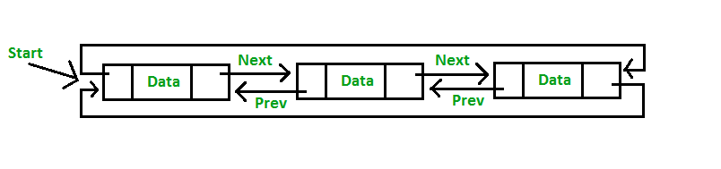

= Java: Collectionlar
:source-highlighter: highlight.js
Anıl Şenocak <senocakanil@gmail.com>
2.0, April 16, 2024
:description: Collectionlar, tek bir birim halinde bir araya getirilmiş birden çok nesne grubudur.
:organization: Personal
:doctype: book
:preface-title: Preface
// Settings:
:experimental:
:reproducible:
:icons: font
:listing-caption: Listing
:sectnums:
:toc:
:toclevels: 3
:xrefstyle: short
:nofooter:

[%notitle]
--
[abstract]
{description}
--
== İmplementasyonlar
- `Java Collection`
List, Set, Stack, Queue ve Deque gibi genel bir koleksiyonda mümkün olan işlemleri temsil eder. Örneğin, öğelere dizinlerine göre erişme yöntemleri, sıralama gibi generic metodlar Collection interface'inde mevcuttur.
- `Java List` Sıralı bir koleksiyonu temsil eder. Sıralı demek, öğelere listede bulundukları sırayla erişebiliriz. Aynı eleman listede olabilir.
- `Java Set` Sırasız bir koleksiyonu temsil eder. Listeden farklı olarak, bir Set'in öğelerine herhangi bir garantili sırada erişmenize izin vermez. Öğeleri doğal sıralarına göre sıralayan Set'in metodları vardır, ancak Set interface'in kendisi böyle bir garanti sağlamaz. Listede sadece uniqe elemanlar olabilir. TreeSet sıralı izin veriyor.
- `Java SortedSet` Sıralı bir koleksiyonu temsil eder. Böylece, SortedSet'teki öğeler sıralı düzende yinelenebilir.
- `Java navigableSet` SortedSet interface'in bir uzantısıdır ve NavigableSet'teki öğelerin her seferinde gezinmesi için ek metodlar içerir.
- `Java Map` Nesneleri key-value şeklinde temsil eder. Hem key hem de value nesnelerdir. Bir Map'e bir key-value eklersek ve daha sonra değeri key aracılığıyla alabiliriz, değeri daha sonra Map'den yeniden okumak için yalnızca anahtara ihtiyacınız olduğu anlamına gelir.
- `Java SortedMap` Map'teki keylerin sıralandığı bir Map'i temsil eden Map uzantısıdır. Böylece, SortedMap'te saklanan keyler, normal bir Map'te tekrarlanan türden rastgele bir düzen yerine, sıralı düzende alabiliriz
- `Java NavigableMap` SortedMap'in bir uzantısıdır ve NavigableMap'te key-value nesneleri arasında kolay gezinme için ek metodlar içerir.
- `Java Stack` Nesnelerin stack'in en üstüne itilebildiği ve daha sonra stack'in tepesinden yeniden çıkarılabildiği klasik bir yığın veri yapısını temsil eder(LIFO - Last In First Out / First In Last Out).
- `Java Queue` Nesnelerin kuyruğun bir sonuna eklendiği ve kuyruğun başından nesnenin çıkarıldığı veri yapısını temsil eder(FIFO - First In First Out / Last In Last Out). Stack'in tam tersi.
- `Java Deque` Çift uçlu bir kuyruğu temsil eder; bu, kuyruğun her iki ucuna öğeler ekleyip kaldırabileceğimiz bir veri yapısı anlamına gelir. Buna çift uçlu stack da diyebilirdik
- `Java Iterator` Bir tür Java koleksiyonunu yineleme yeteneğine sahip bir bileşeni temsil eder. Örneğin, bir List veya Stack.
- `Java Iterable` Sorumluluk açısından Iterator interface'ine çok benzer. Java'daki for-each döngüsü kullanılarak yinelenmesine izin verir. Java Yinelenebilir arabirimi aslında Java Koleksiyon API'sinin bir parçası değildir, ancak Java Koleksiyon API'si ile çok sık kullanılır.
- `Java Properties` Java Map interface'ine benzer özel bir key/value olarak nesneleri tutar, ancak özellikle key ve value çiftinin string değer olmasını hedefleyen ve özellik dosyalarından özellikleri yükleyip depolayabilmeyi amaçlar.

== Iterator
Tüm hiyerarşide en üsttedir; bu, her collection sınıf ve arabirimin onu uyguladığı anlamına gelir. Birincil işlevi, kullanıcının tüm koleksiyon sınıfı nesneleri arasında basit veri öğeleri dizileriymiş gibi geçiş yapmasına izin vermektir.(Veriye erişmek)

- Java'daki en eski mekanizmalardan biridir (en eski olmasa da - Enumeration, Yineleyiciden önce).
- Sadece Collection'lar için kullanabiliriz, Array'lerde kullanamayız.

`Iterable` An iterator over a collection. Iterator takes the place of Enumeration in the Java Collections Framework.

`Enumeration` An object that implements the Enumeration interface generates a series of elements, one at a time. Successive calls to the nextElement method return successive elements of the series.

[source,kotlin]
----
fun main() {
    val list: MutableList<String> = ArrayList<String>()
        .also {
            it.add("one")
            it.add("two")
            it.add("three")
        }
    val iterator: Iterator<String> = list.iterator()
    while (iterator.hasNext()) {
        println(message = "Element: ${iterator.next()}")
    }
}
/*
Element: one
Element: two
Element: three
 */
----
Iterable interface 3 metodu olmakla beraber sadece 1 tanesini implement etmeliyiz. Diğer ikisi default implementasyonlardır.
[source,java]
----
public interface Iterable<T> {
  Iterator<T>    iterator();
  Spliterator<T> spliterator();
  void           forEach(Consumer<? super T> action);
}
----
|===
|Method|Tanım

|hasNext()|Iterator'da daha fazla öğe varsa true, yoksa false döndürür.
|next()|Iterator'daki bir sonraki elemanı verir
|remove()|next() metodundan gelen en son öğeyi Koleksiyondan kaldırır.
|forEachRemaining()|Iterator'da kalan tüm öğeler iterate eder ve kalan her öğeyi lambda ifadesine parametre olarak ileten bir Java Lambda İfadesi çağırır.
|===

=== Iteration Sırası
Nesnelerin işlenme sırası, Interator'ı sağlayan nesneye bağlıdır. Örneğin, bir Listeden elde edilen bir iterator, öğelerin List'e eklendiği sırayla yinelenir. Set'den elde edilen ise, Set'deki öğelerin yinelenme sıraası hakkında herhangi bir garanti vermez.
[source,kotlin]
----
fun main() {
    val set: MutableSet<String> = HashSet<String>()
        .also {
            it.add("90")
            it.add("34")
            it.add("12")
            it.add("78")
            it.add("56")
        }
    val iteratorSet: Iterator<String?> = set.iterator()
    while (iteratorSet.hasNext()) {
        println(message = "Element: ${iteratorSet.next()}")
    }
}
/*
Element: 34
Element: 12
Element: 78
Element: 56
Element: 90
*/
----

=== Iteration Sırasında Değişiklik
Bazı koleksiyonlar, bir Iterator aracılığıyla yinelerken koleksiyonu değiştirmemize izin vermez. Bu durumda, Iterator next() yöntemini bir sonraki çağırışımızda bir `ConcurrentModificationException` alırız. Set hata vermez.

Iterator, next() tarafından döndürülen öğeyi koleksiyondan kaldırmamıza izin veren bir `remove()` metoduna sahiptir. Remove() öğesinin çağrılması `ConcurrentModificationException` öğesinin atılmasına neden olmaz.
[source,kotlin]
----
fun main() {
    val list: MutableList<String> = ArrayList<String>()
        .also {
            it.add("one")
            it.add("two")
            it.add("three")
        }
    val iteratorList: Iterator<String> = list.iterator()
    list.add("five")
    //list.remove(element = "four")
    //list.removeAt(index = 0)
    while (iteratorList.hasNext()) {
        println(message = "Element: ${iteratorList.next()}")
    }
}
/*
Exception in thread "main" java.util.ConcurrentModificationException
	at java.base/java.util.ArrayList$Itr.checkForComodification(ArrayList.java:1095)
	at java.base/java.util.ArrayList$Itr.next(ArrayList.java:1049)
	at com.github.senocak.blog.CollectionlarKt.main(collectionlar.kt:35)
	at com.github.senocak.blog.CollectionlarKt.main(collectionlar.kt)
*/
----

=== Soru: ListIterator'da neden add() metodu var, ancak Iterator'da yok?
ListIterator, bir Koleksiyonun her iki yönünde de iterate eder. Önceki ve sonraki öğeler için iki pointer tutar. `next()` metodu tarafından döndürülen öğeden hemen önce listeye bir öğe eklemek için `add()` yöntemini kullanabiliriz. Bu nedenle next() metoduna yapılan sonraki istek etkilenmeyecektir ve previous() metoduna yapılan istek, yeni eklenen öğeyi döndürür.

Iterator'da sadece bir yönde hareket edebiliriz. Yani orada add() yönteminin bir amacı yoktur.

=== forEachRemaining()
Iterator'da kalan tüm öğeleri dahili olarak yineler ve her öğe için forEachRemaining() öğesine parametre olarak geçirilen bir Java Lambda İfadesi çağırır.
[source,kotlin]
----
fun main() {
    val list: MutableList<String> = ArrayList<String>()
        .also {
            it.add("one")
            it.add("two")
            it.add("three")
        }
    list.iterator().forEachRemaining { println(message = it) }
    /*
    one
    two
    three
    */
}
----

=== ListIterator
Iterator interface'ini extend eder. Çift yönlü bir iterator temsil eden Java ListIterator interface'i, yani öğelerde hem ileri hem de geri gezinebileceğiniz bir iterator.
[source,kotlin]
----
private fun main() {
    val list: MutableList<String> = ArrayList<String>()
        .also {
            it.add("one")
            it.add("two")
            it.add("three")
        }

    val listIterator = list.listIterator()
    listIterator.add("five") // listenin en başına ekliyor
    while (listIterator.hasNext()) {
        val s = listIterator.next()
        println(message = "next: $s hashcode: ${s.hashCode()}")
    }
    println(message = "-----------------")
    while (listIterator.hasPrevious()) {
        val s = listIterator.previous()
        println(message = "next: $s hashcode: ${s.hashCode()}")
    }
    println(message = list)
    /*
    next: one hashcode: 110182
    next: two hashcode: 115276
    next: three hashcode: 110339486
    -----------------
    next: three hashcode: 110339486
    next: two hashcode: 115276
    next: one hashcode: 110182
    next: five hashcode: 3143346
    [five, one, two, three]
    */
}
----

=== Custom Implementation
Özel yapılmış bir koleksiyonumuz olduğunu düşünelim, bunun öğelerini yineleyebilen bir Iterator oluşturmak için Java Iterator interface'ini kendimiz uygulayabiliriz.
[source,kotlin]
----
fun main(){
    val list: MutableList<String> = ArrayList<String>()
        .also {
            it.add("one")
            it.add("two")
            it.add("three")
        }
    val iterator = CustomListIterator(source = list)
    while (iterator.hasNext()) {
        println(message = "Element: ${iterator.next()}")
    }
    /*
    hasNext: true index: 0 size: 3
    Element: one
    hasNext: true index: 1 size: 3
    Element: two
    hasNext: true index: 2 size: 3
    Element: three
    hasNext: false index: 3 size: 3
    */
}
internal class CustomListIterator<T>(private val source: List<T>) : Iterator<T> {
    private var index = 0
    override fun hasNext(): Boolean = (this.index < source.size)
        .also { println(message = "hasNext: $it index: ${this.index} size: ${source.size}") }
    override fun next(): T = source[index++]
}
----

== Iterable
Yinelenebilir(iterable) olan bir nesnelerin koleksiyonunu temsil eder. Bu, Iterable interface'ini uygulayan bir sınıfın öğelerini yineleyebileceği anlamına gelir.
[source,java]
----
// Implementing this interface allows an object to be the target of the "for-each loop" statement. @since 1.5
public interface Iterable<T> {
    // Returns an iterator over elements of type {@code T}.
    Iterator<T> iterator();

    // Performs the given action for each element of the Iterable until all elements have been processed or the action throws an exception. @since 1.8
    Spliterator<T> spliterator();

    // Creates a {@link Spliterator} over the elements described by this Iterable @since 1.8
    void forEach(Consumer<? super T> action);
}
----
Iterable interface'i, Java Koleksiyonları API'sinin kök arabirimlerinden biridir. Bu nedenle, Java'da Java Iterable interface'ini implement eden birkaç sınıf vardır. Bu sınıflar böylece kendi iç öğelerini yineleyebilir. Ayrıca bu interface'i extend eden birkaç interface de vardır.

Collection interface'i, Iterable'i extend eder, böylece Collection'ın tüm alt türleri, Iterable interface'ini de uygular. Örneğin, hem List hem de Set interface'leri, Collection interface'ini extend ettiği için dolayısıyla Iterable interface'ini de extend eder.
[source,kotlin]
----
class Kisi(val isim: String, val yas: Int)
class Kisiler: Iterable<Kisi> {
    private val persons: MutableList<Kisi> = ArrayList<Kisi>()
        .also {
            it.add(element = Kisi(isim = "John", yas = 30))
            it.add(element = Kisi(isim = "Jane", yas = 25))
            it.add(element = Kisi(isim = "Jack", yas = 20))
        }
    override fun iterator(): Iterator<Kisi> = persons.iterator()
        .also { println(message = "returned iterator") }
}
fun main() {
    val list = Kisiler()
    val it: Iterator<Kisi> = list.iterator()
    while (it.hasNext()) {
        val p: Kisi = it.next()
        println(message = "İsim: ${p.isim}, yaş: ${p.yas}")
    }
}
/*
returned iterator
İsim: John, yaş: 30
İsim: Jane, yaş: 25
İsim: Jack, yaş: 20
 */
----

=== Iterator vs Iterable Performans
[source,kotlin]
----
fun main() {
    val list: MutableList<String> = ArrayList()
    for (i in 0..<50_000_000) {
        list.add(element = i.toString())
    }
    iteratorPerformansTest(list = list)
    forEachPerformansTest(list = list)
    forPerformansTest(list = list)
    whilePerformansTest(list = list)
    doWhilePerformansTest(list = list)
    streamPerformansTest(list = list)
    streamParallelPerformansTest(list = list)
    recursivePerformansTest(list = list, start = 0)
}
private fun iteratorPerformansTest(list: List<String>) {
    val timeInMillis = measureTimeMillis {
        val iterator = list.iterator()
        while (iterator.hasNext()) {
            val obj: Any = iterator.next()
        }
    }
    println(message = "Time taken after iterator: $timeInMillis")
}
private fun forEachPerformansTest(list: List<String>) {
    val timeInMillis = measureTimeMillis {
        for (element in list) {
            val obj: Any = element
        }
    }
    println("Time taken foreach: $timeInMillis")
}
private fun forPerformansTest(list: List<String>) {
    val timeInMillis = measureTimeMillis {
        for (i in list.indices) {
            val obj: Any = list[i]
        }
    }
    println("Time taken for loop: $timeInMillis")
}
private fun whilePerformansTest(list: List<String>) {
    val timeInMillis = measureTimeMillis {
        var i = 0
        while (i < list.size) {
            val obj: Any = list[i]
            i++
        }
    }
    println("Time taken while: $timeInMillis")
}
private fun doWhilePerformansTest(list: List<String>) {
    var i = 0
    val timeInMillis = measureTimeMillis {
        do {
            val obj: Any = list[i]
            i++
        } while (i < list.size)
    }
    println("Time taken do while: $timeInMillis")
}
private fun streamPerformansTest(list: List<String>) {
    val timeInMillis = measureTimeMillis {
        list.stream().forEach { val obj: Any = it }
    }
    println("Time taken stream: $timeInMillis")
}
private fun streamParallelPerformansTest(list: List<String>) {
    val timeInMillis = measureTimeMillis {
        list.stream().parallel().forEach { val obj: Any = it }
    }
    println("Time taken stream parallel: $timeInMillis")
}
private fun recursivePerformansTest(list: List<String>, start: Int) {
    // StackOverflowError
    if (start < list.size) {
        val obj: Any = list[start]
        recursivePerformansTest(list=list, start=start + 1)
    }
}
/*
Time taken after iterator: 56
Time taken foreach: 830
Time taken for loop: 7
Time taken while: 42
Time taken do while: 40
Time taken stream: 782
Time taken stream parallel: 155
Exception in thread "main" java.lang.StackOverflowError
*/
----
TIP: for-each döngüsünün daha yavaş olmasının nedeni, her yinelemenin yeni bir iterator nesnesi oluşturacak olan List iterator() yöntemini çağırmasıdır.

== Collection
Java'da Collection interface'inin kullanılabilir implementation'ı yoktur, bu nedenle listelenen alt türlerden birini kullanmanız gerekecektir. Collection interface'i, Collection alt türlerinin her birinin paylaştığı bir dizi yöntemi (davranış) tanımlar. Bu, kullandığımız belirli Collection türünü görmezden gelmemizi ve yalnızca Collection olarak ele almamızı sağlar. Bu standart bir kalıtımdır, yani sihirli bir yanı yoktur, ancak yine de zaman zaman güzel bir özellik olabilir.

- List
- Set
- SortedSet
- NavigableSet
- Queue
- Deque

=== Generic Collections
Java Collections API'sindeki bileşenler için generic oluşturmak mümkündür.
[source,java]
----
Collection<String> stringCollection = new HashSet<String>(); // Generic Collection
Iterator<String> iterator = stringCollection.iterator(); // Generic Iterator
----

=== Collections
Java Collections sınıfı, java.util.Collections, Java'da koleksiyonlarla çalışmak için uzun bir yardımcı program yöntemleri listesi içerir.
[source,kotlin]
----
private fun collections() {
    val index = Collections.binarySearch(list, "two")
    println(message = "Index: $index")
    // Index: 1
}
----
- `addAll()` Collection'a birden fazla eleman ekler.
- `copy()` bir Listenin tüm öğelerini başka bir Listeye kopyalar.
- `reverse()` bir Java Listesindeki öğeleri tersine çevirebilir.
- `shuffle()` bir Listenin öğelerini karıştırabilir.
- `sort()` bir Java Listesini sıralayabilir.
- `min()` öğelerin doğal sırasına göre bir Listedeki minimum öğeyi bulabilir.
- `max()` öğelerin doğal sırasına göre bir Listedeki maximun öğeyi bulabilir.
- `replaceAll()` bir öğenin tüm oluşumlarını başka bir öğeyle değiştirebilir.
- `unmodifiableSet()` normal bir Java Setinden değişmez (unmodifiable) bir Set oluşturabilir.

=== List
Java List interface'i, java.util.List, sıralı bir nesne dizisini temsil eder. Java Listesinde bulunan öğeler, Java Listesinde dahili olarak göründükleri sıraya göre eklenebilir, erişilebilir, yinelenebilir ve kaldırılabilir. Öğelerin sıralanması, bu veri yapısının List olarak adlandırılmasının nedenidir.

Her öğenin bir indeksi vardır. Listedeki ilk elemanın indeksi 0, ikinci elemanın indeksi 1 vb. İndeks, #listenin başlangıcından kaç eleman uzakta# anlamına gelir. Böylece ilk eleman, listenin başlangıcından 0 eleman uzaktadır - çünkü listenin başındadır.

Herhangi bir Java nesnesini bir Listeye ekleyebiliriz. Liste, Generics kullanılarak yazılmamışsa, aynı Listede farklı türlerdeki (sınıflardaki) nesneleri bile karıştırabiliriz. Bununla birlikte, aynı Listede farklı türdeki nesneleri karıştırmak pratikte genellikle yapılmaz. Java List arabirimi standart bir arabirimdir ve Java Koleksiyonu arabiriminin bir alt türüdür, yani List'in Collection'dan devraldığı anlamına gelir.

- java.util.ArrayList (En çok kullanılan)
- java.util.LinkedList
- java.util.Vector
- java.util.Stack

`java.util.concurrent` paketinde de concurrent List uygulamaları vardır.

- `CopyOnWriteArrayList` Tüm mutative işlemlerin (add, set, vb.) temel dizinin yeni bir kopyasını oluşturarak uygulandığı java.util.ArrayList'in iş parçacığı güvenli(thread-safe) bir çeşidi.
- `CopyOnWriteArraySet` Tüm işlemleri için dahili bir CopyOnWriteArrayList kullanan bir Set.
- `ConcurrentHashMap` Bir sınıf, birden fazla iş parçacığından erişildiğinde doğru şekilde davranıyorsa iş parçacığı güvenlidir.

Listeye null değer ekleyebiliriz.

Eğer aynı index'e birden fazla eleman eklersek, sıralamada var olan eleman aşağı itilecektir yani 0 dizinine eklenmeden önce 0 dizinine sahip eleman 1 dizinine iletilecektir.
[source,kotlin]
----
fun main() {
    val list: MutableList<String> = ArrayList<String>()
    .also {
        it.add("one")
        it.add("two")
        it.add("three")
    }
    list.add(index = 1, element = "four")
    println(message = list)
    // [one, four, two, three]
}
----

==== ArrayList
ArrayList, java.util paketinde bulunabilen, yeniden boyutlandırılabilir bir dizidir. Java'da Array ile ArrayList arasındaki fark, bir dizinin boyutunun değiştirilememesidir (bir diziye eleman eklemek veya diziden öğe çıkarmak istiyorsanız, yeni bir tane oluşturmanız gerekir). ArrayList'e istediğiniz zaman öğeler eklenebilir ve kaldırılabilir.

ArrayList, verileri dahili olarak depolamak için bir Nesnelerden oluşan Array'ı kullanır.

Bir ArrayList'i oluşturduğunuzda, 10 boyutunda (varsayılan kapasite) bir dizi oluşturulur ve ArrayList'e eklenen bir öğe aslında bu diziye eklenir. 10 varsayılan boyuttur ve ArrayList başlatılırken parametre olarak geçirilebilir.

==== LinkedList
LinkedList hemen hemen ArrayList ile aynıdır. Öğelerin bitişik konumlarda depolanmadığı ve her öğenin veri bölümü ve adres bölümü olan ayrı bir nesne olduğu doğrusal bir veri yapısıdır. Öğeler, işaretçiler ve adresler kullanılarak bağlanır. Her eleman bir düğüm olarak bilinir. Ekleme ve silme işlemlerinin dinamikliği ve kolaylığı nedeniyle tercih edilirler.

- `singly linked list` Tek yönlü bir bağlı listedir. Yalnızca bir yönde, yani baş düğümden kuyruk düğümüne geçebilirsiniz. Listedeki son düğüm kuyruktur ve NULL'a işaret eder.

- `doubly linked list` Çift yönlü bağlı bir listedir. Böylece her iki yönde de hareket edebiliriz. Tek yönlü bağlı listelerin aksine, düğümleri "previous" pointer olarak adlandırılan fazladan bir işaretçi içerir.

- `circular linked list` Dairesel Bağlı liste, tek yönlü bağlı bir listedir. Böylece, onu sadece bir yönde hareket ettirebiliriz. Ancak bu tür bağlantılı listelerin son düğümü baş düğümü gösterir. Bu yüzden geçiş yaparken dikkatli olmanız ve baş düğümü tekrar ziyaret ettiğinizde geçişi durdurmanız gerekir.

- `circular doubly linked list` Dairesel çift bağlı liste, çift bağlı liste ile dairesel bağlı listenin bir karışımıdır. Çift bağlı liste gibi, önceki işaretçi olarak adlandırılan fazladan bir işaretçiye sahiptir ve dairesel bağlı listeye benzer şekilde, son düğümü baş düğümdedir. Bu tür bağlı liste, çift yönlü listedir. Böylece her iki yönde de hareket edebilirsiniz.

==== Vector
Vektör, boyutunu büyütebilen veya küçültebilen dynamic array gibidir. Diziden farklı olarak, boyut sınırı olmadığı için içinde n sayıda öğe saklayabiliriz.

Vector sınıfını `thread-safe` uygulamalarda kullanılması önerilir. İş parçacığı güvenli uygulamayı kullanmanız gerekmiyorsa, ArrayList'i kullanmalısınız, bu durumda ArrayList daha iyi performans gösterecektir.

Vector sınıfı tarafından döndürülen Iterator'lar, fail-fast'tır. Concurrent modification durumunda, başarısız olur ve `ConcurrentModificationException` ı atar.

Vector synchroniztır.

Vector, collections framework'ün parçası olmayan birçok legacy metod içerir.

==== Synchronization
Birden fazla thread aynı anda bir ArrayList'e erişiyorsa, listeyi yapısal olarak(listeden eleman(lar)ın eklenmesi veya silinmesi) değiştiren veya bir öğeyi basitçe değiştiren kod bloğunu harici olarak senkronize etmeliyiz. Mevcut bir elemanın değerini ayarlamak yapısal bir değişiklik değildir.

==== Data growth
Hem ArrayList hem de Vector, bir Array kullanarak içeriklerini tutar. ArrayList'e veya Vector'e bir öğe eklendiğinde, yer biterse nesnenin dahili dizisini genişletmesi gerekir. Bir Vector varsayılan olarak dizisinin boyutunu iki katına çıkarır, ArrayList ise dizi boyutunu yüzde 50 artırır.

=== Set
İçindeki her nesnenin benzersiz olduğu bir nesneler koleksiyonunu temsil eder. Başka bir deyişle, aynı nesne birden fazla olamaz. Standart bir Java interface'idir ve Java Koleksiyonu arabiriminin bir alt türüdür; bu, Set'in Koleksiyondan devraldığı anlamına gelir.

Herhangi bir Java nesnesini bir Java Set'ine ekleyebilirsiniz. Set, Java Generics kullanılarak yazılmamışsa, aynı Set içinde farklı türlerdeki (sınıflardaki) nesneleri bile karıştırabilirsiniz. Bununla birlikte, aynı Kümede farklı türdeki nesneleri karıştırmak çoğu zaman yapılmaz.

- `java.util.EnumSet` enum sınıflarıyla çalışmak için özel bir Set koleksiyonudur.
- `java.util.HashSet` HashMap tarafından desteklenir. Öğeleri yinelediğinizde, öğelerin sırası hakkında hiçbir garanti vermez.
- `java.util.LinkedHashSet` HashSet'ten farklı olarak, yineleme sırasında öğelerin sırasının Set'e eklendikleri sıra ile aynı olmasını garanti eder. Halihazırda LinkedHashSet'te bulunan bir öğenin yeniden eklenmesi bu sırayı değiştirmez.
- `java.util.TreeSet` iterate edildiğinde öğelerin sırasını da garanti eder, ancak sıra, öğelerin sıralama düzenidir.

=== Set vs. List
- Aynı öğenin Set'te birden fazla bulunamamasıdır. Bu, her öğenin birden çok kez meydana gelebileceği Java Listesinden farklıdır.
- Set'teki öğelerin garantili bir iç sıraya sahip olmamasıdır. List'teki öğelerin bir iç sırası vardır ve öğeler bu sırayla yinelenebilir.

=== Set.of()
Java 9'dan beri Set interface'i, immutable Set örnekleri oluşturabilen bir dizi statik metodlar içerir.
[source,kotlin]
----
private fun setOf() {
    java.util.Set.of("val1", "val2", "val3")
    setOf("val1", "val2", "val3") // Kotlin impl
}
----

