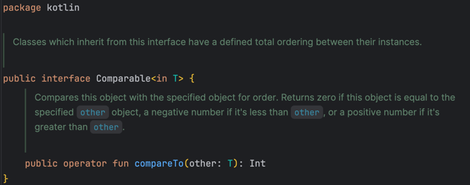
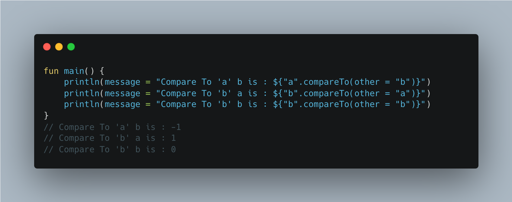
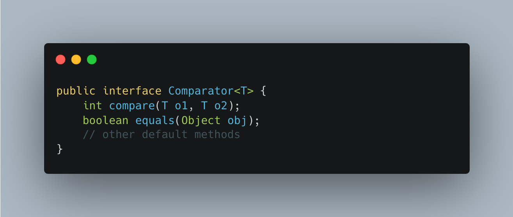
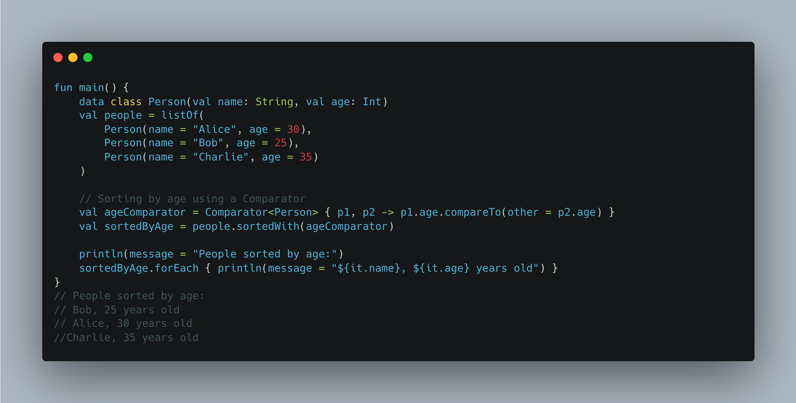

= Java: Comparable vs Comparator
:source-highlighter: highlight.js
Anıl Şenocak <senocakanil@gmail.com>
2.0, April 16, 2024
:description: Comparable and Comparator are interfaces used for sorting objects.
:organization: Personal
:doctype: book
:preface-title: Preface
// Settings:
:experimental:
:reproducible:
:icons: font
:listing-caption: Listing
:sectnums:
:toc:
:toclevels: 3
:xrefstyle: short
:nofooter:

[%notitle]
--
[abstract]
{description}
--

== Comparable
Kendisini başka bir nesneyle karşılaştırmak için kullanılan bir nesnedir. Özel nesnelerin listesini sıralamaya yardımcı olur. `java.lang.Comparable` interface'ini nesneleri karşılaştırmak için implement etmeliyiz. Bu interface'i uygulayan nesneler, `Arrays.sort` ve `Collections.sort` yöntemleriyle otomatik olarak sıralanır. Orijinal sınıfı etkiler. yani, gerçek sınıf değiştirilir. Calendar, Date, tüm wrapper sınıfları ve String sınıfı bu interface'i uygular

=== CompareTo()
String üzerinde doğal(Natural) sıralama yapmak için kullanılır. Doğal sıralamanın anlamı, nesneye uygulanan sıralama düzenidir, örneğin tamsayıları sıralamak için sayısal düzen, String için alfabetik sıra vb.

`T` karşılaştıracağınız nesnelerin türünü belirtir. Bu metod, nesneyi T nesnesiyle karşılaştırır.

- Değerler eşitse 0 döndürür.
- Nesnenin daha küçük bir değere sahip olması durumunda, bu yöntem negatif bir değer döndürür.
- Nesne daha yüksek bir değere sahipse, pozitif bir değer döndürür.

#Alfabetik olarak "a" karakteri "b"den önce gelir. Bu nedenle, ilk çıktı -1'dir. "b" karakteri alfabetik olarak "a"dan sonra gelir. Dolayısıyla çıktı ikinci 1'dir. Son çıktı değerler eşit olduğu için 0'dır.#

== Comparator
Farklı sınıfların farklı nesnelerini karşılaştırmak için kullanılan bir nesnedir. Kullanıcı tanımlı sınıfların nesnelerini düzenlemek için de kullanılır. `compare` ve `equals` olarak bilinen iki önemli karşılaştırıcı yöntemini içerir. java.util paketinde ve  bulunur. Sıralamak istenilen sınıf bir comparator interface uygulamasına gerek yoktur. Orijinal sınıfı etkilemez, yani gerçek sınıf değiştirilmez. Uygulanan tek Comparator sınıfları, Collator ve RuleBasedColator'dır.

=== Compare()
nesneleri sıralamamızı sağlar. Bunu yapmak için comparator interface'i uygulayan bir sınıf oluşturmanız gerekir. Bundan sonra, karşılaştırma yöntemini geçersiz kılmanız gerekir.

- İlk argüman ikinciden küçükse negatif bir tamsayı döndürür.
- İlk argüman ve ikinci argüman eşitse sıfır döndürür.
- Bu yöntem, ilk argümanın ikinciden büyük olması durumunda pozitif bir tamsayı döndürebilir.

=== Equals()
Sayı nesnesinin, argument olarak iletilen nesneye eşit olup olmadığını doğrular.

[source,kotlin]
----
val equalityComparator = Comparator<Person> { p1, p2 -> if (p1.name == p2.name && p1.age == p2.age) 0 else -1 }
----

== Comparator ve Comparable Ana Farklılıklar:
- Comparable, öğeleri sıralamak için compareTo() yöntemini sağlarken, Comparator, öğeleri sıralamak için compare() yöntemini sağlar. Kotlin'de Comparator kullanılır.
- Comparable `java.lang` paketinde, Comparator `java.util` paketinde bulunur.
- Comparable tek sıralama dizisi sağlarken, Comparator birden çok sıralama dizisi sağlar.
- Comparable, orijinal sınıfı etkilerken, Comparator orijinal sınıfı etkilemez.

== Comparator ve Comparable Best Praktikler;

- Karşılaştırma, belirli bir sınıf için standart ise comparable kullanabiliriz.
- Lambdaları comparator ile kullanabiliriz.
- Mevcut birçok core sınıflar, comparable uygular.
- TreeSet ve TreeMap'i veya sıralarken Set veya Map kullanmak mümkündür.
- CompareTo() yöntemi, comparator olduğu kadar comparable ile de çalışır.
- Comparator'i yalnızca `<` esnekliğine ihtiyacımız olduğunda kullanabiliriz.
- compareTo() yöntemi, ilk nesne diğerinden büyükse pozitif bir tamsayı, daha düşükse negatif ve her ikisi de aynıysa sıfır döndürür.

link:examples/comparable-vs-comparator.kt[comparable-vs-comparator.kt]