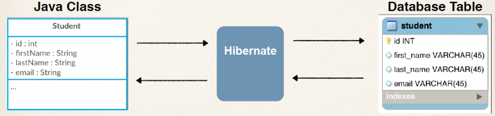

= Hibernate vs Spring Data JPA
:source-highlighter: highlight.js
Anıl Şenocak <senocakanil@gmail.com>
2.0, April 16, 2024
:description: Hibernate bir JPA uygulamasıdır, Spring Data JPA ise bir JPA Veri Erişim Soyutlamasıdır.
:organization: Personal
:doctype: book
:preface-title: Preface
// Settings:
:experimental:
:reproducible:
:icons: font
:listing-caption: Listing
:sectnums:
:toc:
:toclevels: 3
:xrefstyle: short
:nofooter:

[%notitle]
--
[abstract]
{description}
--

== JPA (Java Persistence API)
JPA, Java nesnelerini ilişkisel bir veritabanına eşlemek için Java standardıdır. JPA, ORM yaklaşımıdır. Geliştirici, JPA aracılığıyla, ilişkisel veritabanlarından Java nesnelerine crud(create/read/update/delete) işlemlerine izin verir. JPA, Java-EE ve Java-SE uygulamalarında kullanılabilir. JPA bir spesifikasyondur ve çeşitli uygulamalar mevcuttur.

== ORM (Objet Relational Mapping)
ORM, tamamen Entity olarak adlandırılan düz Java Nesneleri biçimindeki verileri temsil etmek ve bunlara erişmekle ilgili olan JPA'nın temelidir. Hibernate, EclipseLink ve Apache OpenJPA gibi kütüphaneler JPA uygulamalarından bazılarıdır.

== Hibernate
Hibernate, Java ortamları için bir ORM çözümüdür. Hibernate, uygulama etki alanı nesnelerini ilişkisel veritabanı tablolarıyla eşlemek için bir çerçeve sağlayan Java tabanlı bir ORM aracıdır. Hibernate, JPA'nın bir referans uygulamasını sağlar ve bu, onu gevşek birleştirme avantajlarıyla ORM aracı olarak mükemmel bir seçim haline getirir.  Hibernate, Java tabanlı bir ORM teknolojisidir.

TIP: Buraya kadar yazılanlardan yola çıkarak JPA (Java Persistence Api) ‘ın bir standart, Hibernate’in ise bir JPA uygulaması olduğunu aklımızdan çıkarmayalım.

== Spring Data
Spring Data ailesinin bir üyesidir. JPA tabanlı repository'lerin kolayca uygulanmasını kolaylaştırır. Bu modül, JPA tabanlı veri erişim katmanları için gelişmiş destek verir.

Spring Data sanıldığı aksine Hibernate gibi bir JPA uygulaması değildir. Sadece JPA uygulamamızın en üst katmanına ekstra soyut bir katman ekleyen bir kütüphanedir.

== Spring Data JPA
Veri erişim teknolojilerini kullanan Spring destekli uygulamalar oluşturmayı kolaylaştırır. Bir uygulamanın veri erişim katmanını uygulamak, uzun süredir külfetli olmuştur. Basit sorguları yürütmek, sayfalandırma ve denetleme yapmak için çok fazla standart kod yazılmalıdır.

Spring Data JPA, çabayı gerçekten ihtiyaç duyulan miktara indirerek veri erişim katmanlarının uygulanmasını önemli ölçüde iyileştirmeyi amaçlamaktadır. Bir geliştirici olarak, özel metodlarda dahil olmak üzere, repository interface'ler yazarız ve Spring, uygulamayı otomatik tanır.

== Spring Data JPA vs Hibernate
Spring Data JPA kullanarak aşağıdaki CrudRepository uygulamasını düşünelim:
[source,java]
----
import bookservice.model.Author;
import org.springframework.data.repository.CrudRepository;

public interface AuthorRepository extends CrudRepository {}
----
CrudRepository arayüzünü basitçe genişleterek Spring, aşağıdaki depo yöntemlerini otomatik olarak uygulayacaktır:

- save()
- saveAll()
- findById()
- existsById()
- findAll()
- findAllById()
- count()
- deleteById()
- delete()
- deleteAll()

Nesnelerin veritabanında kalmasını son derece kolaylaştırıyor..

[source,java]
----
Author author = new Author();
repo.save(author); //save to database
List authors = repo.findAll(); //find all authors
----
Spring Data JPA kullanmasaydık, nesneleri veritabanında kalıcı hale getirmek için daha fazla standart kod yazmamız gerekirdi.

[source,java]
----
void saveToDb() {
    EntityManagerFactory emfactory = Persistence.createEntityManagerFactory("Hibernate");

    EntityManager entitymanager = emfactory.createEntityManager();
    entitymanager.getTransaction().begin();

    Author author = new Author();

    entitymanager.persist(author);
    entitymanager.getTransaction().commit();

    entitymanager.close();
    emfactory.close();
}
----
Entity Manager, işlemleri gerçekleştirme ve kapatma ile ilgili kullanıldığına dikkat edin? Bu, Spring Data JPA'nın kaçınmaya yardımcı olduğu kod türüdür.

TIP: Spring Data JPA, bir JPA sağlayıcısı ile çalışmayı kolaylaştıran bir dizi bağımlılıktır. Hibernate, birkaç JPA sağlayıcısından biridir. Bu, Spring Data JPA'yı Hibernate'i kullanmadan kullanabileceğiniz anlamına gelir.

Diyelim ki uygulamamız için spring + hibernate kullanıyoruz. Artık hibernate'in SessionFactory'sini kullanarak crud işlemler için dao arayüzüne ve uygulamasına ihtiyacımız var. Çalışan sınıfı için dao sınıfı yazdığınızı varsayalım daha sonra uygulamamızda başka herhangi bir varlık için benzer işlem yazmamız gerekebilir. Yani burada görebileceğimiz çok sayıda ortak kod var. Şimdi Spring data jpa, repositoryleri(crudrepository, jparepository) genişleterek dao arayüzlerini tanımlamamıza izin veriyor, böylece çalışma zamanında size dao uygulaması sağlıyor. Artık dao uygulaması yazmanıza gerek yok. spring data jpa bu şekilde hayatı kolaylaştırıyor.

== SONUÇ
Hibernate, Java nesnelerini ilişkisel veritabanı tablolarıyla eşleyen bir JPA sağlayıcısı ve ORM'dir. Spring Data JPA, JPA sağlayıcısı ile çalışmayı daha az ayrıntılı hale getiren bir soyutlamadır. Spring Data JPA'yı kullanarak Hibernate gibi bir JPA sağlayıcısının yönetiminde yer alan birçok standart kodu ortadan kaldırabilirsiniz.
