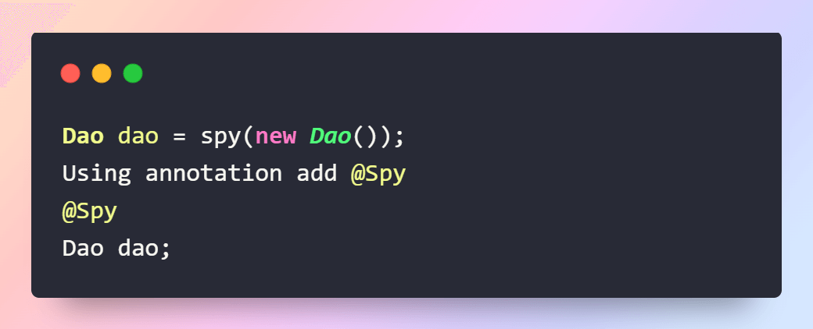

= Java: Mockito: @Spy
:source-highlighter: highlight.js
Anıl Şenocak <senocakanil@gmail.com>
2.0, April 16, 2024
:description: Gerçek nesnenin sadece belirtilen metodları mock kodu tarafından override edilir.
:organization: Personal
:doctype: book
:preface-title: Preface
// Settings:
:experimental:
:reproducible:
:icons: font
:listing-caption: Listing
:sectnums:
:toc:
:toclevels: 3
:xrefstyle: short
:nofooter:
// URIs:
:url-quickref: https://github.com/senocak/tutorials/tree/master/

[%notitle]
--
[abstract]
{description}
--

== Açıklama
Bu, tıpkı bir mock işlemlerde yaptığımız gibi, her etkileşimi izlemeye devam ederken nesnenin tüm normal metodlarını çağırmamıza izin verecektir.

== Örnek
[source,kotlin]
----
@Spy lateinit var authenticationManager: AuthenticationManager
// private val authenticationManager = spy(AuthenticationManager::class.java)

@Test
fun givenSuccessfulPath_whenLogin_thenReturn200() {
    // Given
    `when`(authenticationManager.authenticate(UsernamePasswordAuthenticationToken(
        loginRequest.username, loginRequest.password))).thenReturn(authentication)
    // When
    val response: ResponseEntity<UserWrapperResponse> = authController!!.login(loginRequest, bindingResult!!)
    // Then
    assertNotNull(response)
    assertNotNull(response.body)
    assertEquals(HttpStatus.OK, response.statusCode)
}
----

== Uygulanabilirlik
- Karmaşık bir nesne oluşturma algoritması, nesneyi oluşturan parçalardan ve bunların nasıl birleştirildiğinden bağımsız olmalıdır.
- Yapım süreci, inşa edilen nesne için farklı temsillere izin vermelidir.

== Örnekleri
- java.lang.StringBuilder
- java.nio.ByteBuffer(FloatBuffer, IntBuffer ve benzeri gibi benzer arabelleklerin yanı sıra.)
- java.lang.StringBuffer
- java.lang.Appendable'in tüm implementleri
- Apache Camel builders
- Apache Commons Option.Builder

link:examples/builder-pattern.kt[builder-pattern.kt]
